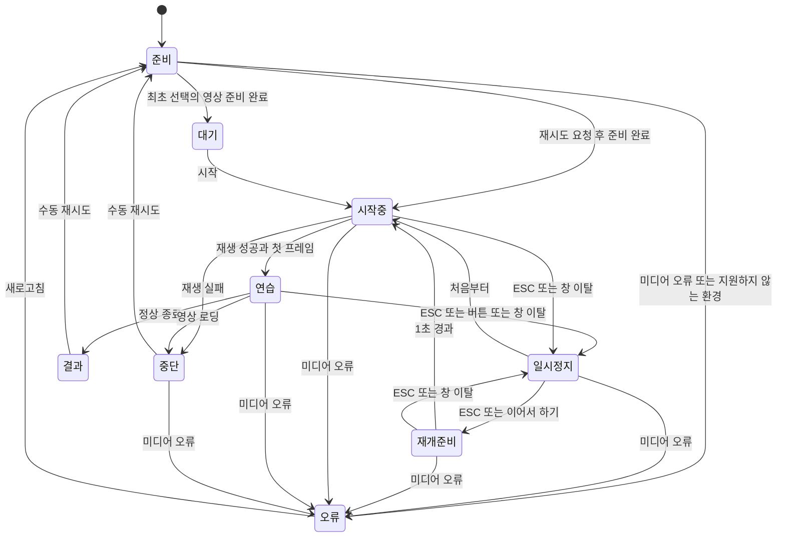

# 강습전 제어스킬 반복훈련 — 제품 요구사항

## 목적과 배경

누구나 접속하는 웹사이트에서 고정된 제어스킬 대응을 반복훈련한다. 베스퍼 두 패턴, 기르타블리르·퇴행 변종, 쿠사리쿠, 환영의 화살 유닛의 총 다섯 패턴을 제공한다. 쿠사리쿠와 환영의 화살 유닛의 확장·정리는 종료했으며, 환영의 화살 유닛은 마지막 SPACE/RMB 선택과 겹침 레인을 포함한다. 원격 공개와 미측정 대체 입력의 추가는 별도 합의를 따른다. 성공 대응 영상과 선택적으로 표시하는 리듬 안내를 통해, 조작점수를 얻는 데 필요한 대응 순서와 타이밍을 익히게 한다.

사용자는 특정 패턴을 한 번 연습하기 위해 앞선 전투를 다시 진행해야 한다. 베스퍼 두 번째 제어스킬의 녹화에서는 매번1분 이상 준비 전투가 필요했다. 사용자가 숙지하려는 대상은 고정된 순서로 진행되는 제어스킬이며, 패턴 전체 수행이 중요하다.

---

## 제품 전체의 연결과 변경 판단

아래는 기존 합의를 찾고 변경의 영향을 추적하는 입구다. 상세 규칙·수치는 연결된 절이 정본이며 여기서 복제하지 않는다. 최우선 목적은 **안내 없이 실제 전투에 대응하도록 순서·간격·여유를 익히는 것**이다. 기능이 작동하거나 개별 요소가 보기 좋아졌다는 사실만으로 이 목적에 적합하다고 판단하지 않는다.

| 영역 | 보존할 제품 성질과 정본 | 다른 영역으로 이어지는 영향 | 확인할 실제 결과 |
|---|---|---|---|
| 학습·리듬 | [학습 목적과 구조](#리듬-안내의-학습-목적과-구조-결정--2026-09-18): 순서·간격·폭을 미리 읽기, 단일 입력 | 타일 축척·아이콘·움직임 → 시선 분산·예고 시간·입력 여유 이해 | 리듬 학습·동작 연결을 검토할 때 실제 영상과 전체 동작 재생. 배치 비교는 관련 공간·대표 타일로 표현 가능; 학습 효과 입증과 구별 |
| 시간·근거 | [대표 시간표](#후속-합의-대표-시간표와-연습-판정), [실험 보고서](experiments/vesper-control-skills.md): 채택 구간·단일 영상 원점 | 영상 편집·교체·재생 방식 → 전조와 타일 정렬·판정·결과 시각 | 원점/폭/순서 대조, 실제 미디어와 판정 시계. 화면 반응을 물리 입력으로 바꾸지 않음 |
| 입력·결과 | [진입 대체 입력](#진입-대체-입력과-후속-확장--2026-09-19), D2·D3, [결과 화면](#결과-화면) | 입력 필터·대체 키 → 성공 소비·중복·추가 입력·결과 행·도움말 | 실제 두 키, 반복/오답/무시 입력과 결과 일치. 웹 허용과 게임 검증 구분 |
| 공간·가독성 | [화면 배분](#리듬-안내-비교-결과와-후속-시각-검토): 영상과 레인의 공통 폭·높이 예산 | 아이콘/라벨 높이 → 영상 높이·폭 → 타일의 픽셀 길이·이동량. 시간 폭과 다른 값 | 전체 화면에서 16:9·공통 폭·헤더 정착·좁고 낮은 창을 확인. 늘어난 공간 비용도 비교에 표시 |
| 상태·조작 | D4·D5, R2·R4: 시작·정지·재시도·스킬 선택·안내 숨김 | 표시 변경 → 영상 요소/시각·포커스·눌림 상태·이전 시도 결과 | 진행/정지 중 변경, 새 시도·포커스 이탈. 바뀌어야 할 상태와 보존할 상태를 구분 |
| 피드백·접근성 | D6, [스타일과 움직임](#리듬-안내의-스타일과-움직임--2026-09-18), [결과 화면](#결과-화면) | 색·기호·움직임 → 성공/가능 상태 구분·결과 지속·키보드/낭독기 접근 | 실제 성공·놓침·추가 입력 상태, 움직임 감소·포커스. 선호와 기계 검사를 구분 |
| 제공·범위·자료 | [성공 기준과 범위](#성공-기준과-범위), [확장 운영](#후속-보스-확장-운영--2026-09-19), README | 임시 비교·연구 가정 → 기본값 채택·배포·보존 자료·다음 controller | 승인된 범위와 산출물 대조. 비교는 비교로 제공하고 채택은 사용자 선택 이후. 스크린샷 전달 대신 실행 주소 |

작업 전에 이번에 사용자가 결정하거나 수행할 일과 관련된 역할·제약·영향을 선택한다. 필요한 구현은 그 역할을 충족하는 정도로 정하며 요소 수의 최소화나 제품 전체 재현을 목표로 삼지 않는다. 예를 들어 아이콘 배치 비교에는 영상의 공간 점유를 나타내는 영역과 대표 레인만으로 크기·간격·식별성을 판단할 수 있다. 움직임·실제 전조와의 관계·동기화가 질문이면 해당 역할을 재현할 장면이나 실행 경로가 필요하다. 생략한 요소가 결론을 바꿀 수 있으면 관련 부분을 보완한다. 영향 연결은 조사 범위를 선택하는 근거이며 연결된 모든 기능의 구현 의무가 아니다.

현재안과 후보에서 판단에 필요한 조건을 맞추고 장점과 비용을 비교한다. 기존 제약으로 결론이 나면 실행하고 실제로 남은 제품 선택만 사용자에게 제시한다. 한 줄 교정에 전체 점검을 반복하거나 모든 대안을 기존 외형으로 제한하지 않는다.

## 리듬 안내의 스타일과 움직임 — 2026-09-18

[zenless.tools](https://zenless.tools/leveling-calculator)의 어두운 중립색 바탕·밝은 아이콘·형광 황록색 강조를 참고한다. 사용자가 선택한 A 배합을 적용한다. 레인은 짙은 회색이며 입력 전은 중립 회색 #7e848c, 입력 가능은 라임 #d5f529, 성공은 선명한 녹색 #2dc88d다. 성공색은 레인·아이콘 테두리·입력 반응·결과 구간에서 공유한다. 실패색과 타일 양끝의 밝은 경계는 유지한다. 아이콘과 구간 띠를 짧은 연결선으로 묶는다. 긴 타일은 구간 안의 단일 입력을 표현하며 홀드나 중앙 정확도 판정을 추가하지 않는다.

구간 진입 때 아이콘은 최대2px, 성공 입력 때 최대3px 들렸다가220ms 안에 돌아온다. 실제 입력은 고정 입력선 주변의 작은 테두리로240ms 동안 반응하며 성공과 추가 입력의 색을 구별한다. 모든 움직임은 영상 시각으로 계산해 일시정지 중 멈추고 재시도하면 초기화한다. 움직임 감소 설정에서는 아이콘 이동과 반응의 크기 변화를 끈다. 판정 띠의 양끝·입력선·이동 속도·실험 구간·영상 정렬은 유지한다. 상시 흔들림·별도 박자·화면 전체 섬광은 추가하지 않는다.

## 합의한 동작

2026-09-22 공개 후 사용자 요청으로 환영의 화살 유닛 진입·3타의 웹 판정만 양 끝25ms씩 임시 확대했다. 이는 아래 실측 기반 채택 원칙에 대한 명시적 서비스 예외이며, 기존 측정값이나 실험 프로필을 갱신한 것이 아니다. 현행 값과 실제 플레이의 미완료 검증은 [환영의 화살 유닛 정본](experiments/arrow-unit-control-skill.md#공개-후-임시-서비스-판정-조정--2026-09-22)을 따른다.

### 연구용 통합 실험기 교정 — 2026-09-19

**성공 구간을 정하는 조건:** 제품은 녹화하지 않는 일반 플레이의 패턴·순서·간격·여유를 익히는 것을 목표로 한다. 녹화 OFF 결과를 구간 결정의 주된 근거로 사용하며, 녹화 ON에서도 성공해야 한다는 조건으로 폭을 줄이지 않는다. 녹화 영상은 동작 확인과 서비스 영상·타일 정렬에 활용한다. 실험기의 감지 지연과 실제 게임 성공 폭을 구별하고, ON의 추가 부하를 사용자가 배워야 할 리듬에 포함하지 않는다. 승인된 순서는 회차 간 50ms 차이 조사 → OFF 실험의 신뢰성 판단 및 필요한 교정 → 베스퍼의 늦은 값 우선 재점검이다. 기존 모든 구간의 재탐색이나 모든 지연 원인의 완전한 복원을 요구하지 않는다.

2026-09-19 후속 승인으로 Execute_02 OFF 재점검을 종료하고 Execute_01의 각 늦은값+50ms와Space진입 이른쪽−50ms 점검으로 이동한다. 02 지원 구간과 B의 진입 키별 폭은 웹에 반영했다. 2026-09-20에는01 OFF 재시험도 종료하고 채택 구간을 반영했다. 영상은전조·시간축의참고예시이고선택한대응의실측구간이판정을결정한다. [채택한 B와 C 전환 조건](#진입-대체-입력과-후속-확장--2026-09-19)를따른다. 조건·결과·반례는 정본 요약으로 보관하고, 원본은 미해결50ms 비교와 현행 서비스 영상처럼 실제 재판독 역할이 있는 것만 남긴다. 상세 값·종료 조건은 실험 보고서를 따른다.

사용자 승인으로 제품 웹앱과 별도인 실험기를 교정한다. 보스별 실행파일을 나누지 않고 프로필·동작별 이른/기준/늦은 값과 진입 RMB/Space를 설정한다. 진입 포함 동작 수는 프로필 내부에서 정하며 사용자 화면에는 읽기 전용으로 표시한다. 수동 타수 변경으로 기존 시각을 삭제·생성하는 흐름은 제거한다. 파티·시작 캐릭터를 보존하고 녹화 상태는 OBS에서 자동 관측한다. 후속 승인으로 F8 인지 시점의 최근 상태를 회차 ON/OFF로 고정하며 결과 저장 시점에는 변경하지 않는다. UNKNOWN은 사용자 정책에 따라 OFF로 취급하여 녹화하지 않을 때 OBS 실행을 요구하지 않는다. 원관측과 정책 분류는 구별하고 현재 표시와 F8 회차 표시를 분리한다. 결과는 해당 회차의 동작 수만큼 0/1을 입력하며 전체 성공 버튼·미확인 관리 기능은 두지 않는다. 최근 회차 정정은 가장 최근 보관 회차 하나를 자동 선택하고 회차 조건을 보여준 뒤 성공/실패 결과 또는 시작 캐릭터를 고르게 한다. 과거 목록·파일 선택은 제거한다. 시작 캐릭터를 정정하면 원본의 실제값과 결과 해시를 함께 갱신하며 당시 설정 스냅샷·입력·녹화 증거는 유지한다. 결과 입력 전에는 임시 회차로 두고, 결과 확정 시에만 보관한다. 결과 없이 다음 회차를 시작하거나 종료하면 임시 로그·감지 이미지를 폐기하며 기존 보관 로그·공유 OBS 영상은 삭제하지 않는다. 이른/기준/늦은 값은 직접 편집하거나 선택 셀 공통 ±50ms 버튼으로 조정하고 설정은 자동 기억한다. 보스와 무관한 최소 간격·행별 탐색 제한은 제거하고 실제 선택 조합의 키 유지 충돌만 검사한다. 프로필은 보스·패턴 중심의 시각·감지·키·파티 조건 묶음이며 파티 변경만으로 새 프로필이 생기지 않는다. 후속 승인으로 실험기에서는 대응별 키 편집을 허용했으며 웹의 후속 회피 표현은 미채택이다. 2026-09-20에는 조합·그룹·별도 진입 키 UI를 제거하고 행별 이른/기준/늦은 실행 셀 및 통일된 키 열로 바꾼다. 행별 선택은 자동 기억하고 최근 보관 회차에는 동작별 키와 실행에 사용한 설정ms만 현재 편집과 분리하여 읽기 전용으로 보여준다. 상세 실행·기록 규칙은 [실험기 사용법](../tools/experiment/사용법.md)을 따른다. 이 교정은 기존 웹앱의 판정 구간을 변경하거나 새 보스의 성공 구간을 확정하지 않는다.
### 준비 대응의 표시와 판정 — 2026-09-21 승인

쿠사리쿠는 사용자 선택 무피격 대표 영상의 **준비 회피1 → 준비 회피2 → 진입 회피 → 1~4타**와 D→W 이동을 안내한다. 준비1·2는 해당 플레이어 경로의 회피 순서이며 보스 타수나 공식 동작명이 아니다. 시작 LMB5는 문구 이전 전투 준비로서 웹 채점에 포함하지 않는다.

준비 회피는 점표식, 이동은 방향 구간으로 같은 영상 시계에 연결한다. 둘 다 비채점 영상 경로 안내이며 성공창·방향 채점·대체 경로 선택 모드를 추가하지 않는다. 준비 RMB 면제는 대표의 마지막 준비 회피 해제까지만 적용한다. 그 이후 너무 이른 진입은 기존 추가입력 판정을 유지한다. 리듬 안내 토글은 준비 안내에도 적용된다. 웹 결과는 진입과 후속4타의 **5개**를 유지한다.

사용자는 측정한 다섯 폭과 새 대표의 서비스 채택 및 쿠사리쿠 종료를 승인했다. 세부 수치와 영상 원점은 [쿠사리쿠 정본](experiments/kusarikku-control-skill.md)을 따른다. 게임의 완벽 대응은01111에서도 나타나므로 게임 배너를 웹5/5나 준비 무피격의 근거로 바꾸지 않는다.

실험기는 준비 시각·유지·방향 편집 및 선택적 준비 문제 메모를 유지한다. v3.9는 F8 시작LMB5와 문구 뒤 RMB·Space를 자동 입력하고 사용자의 WASD와 병행한다. 프로그램은 직접 누른 방향키를 해제하지 않는다. 준비 결과를 기존 다섯 자리 결과에 추가하지 않으며 빈 메모나 전송 완료를 게임 성공으로 해석하지 않는다.

### 진입 대체 입력과 후속 확장 — 2026-09-19

베스퍼의 진입 선택은 당시 비교안 B를 채택해 시작 전에 우클릭/Space 중 하나를 고르고 그 키의 구간으로 연습한다. 패턴별 선택을 기억하고 최초 선택은 영상과 같은 우클릭이다. 이후1~N타는 Space다. 연습·일시정지 중 선택을 잠그며 완료 결과도 당시 키와 구간을 유지한다. 완료 후 다른 입력은 ‘입력 선택으로’ 새 연습을 준비한 뒤 고른다. 표시 설정은 유지한다. 선택과 다른 Space/우클릭 입력도 기록하고 구간 안에서 선택한 키로 다시 대응할 수 있다. 다른 키·마우스 버튼은 무시하며 ESC·UI 조작은 유지한다.

입력별 현행 구간과 영상 원점은 [베스퍼 현행 서비스 표](experiments/vesper-control-skills.md#현재-서비스-적용값) 및 [서비스 미디어 근거](evidence/service-media-20260920.json)를 따른다. 선택 구간은 모든 캐릭터·후속 조합의 성공 보장이 아니며 보고서의 반례와 적용 조건을 함께 사용한다.

타일 위에는 선택한 키의 온전한28px 아이콘 하나를 표시한다. 레인118px·기존 색상·영상 시각에 따른 움직임을 유지한다. 대표 영상은 우클릭 진입과 패링의 예시이며 Space 선택의 동작과 다를 수 있음을 안내한다. 비교 전용 페이지·코드·검사는 제거한다. 다음 비교 판단을 따른다.

| 후보 | 장점 | 비용·한계 | 적합한 역할 |
|---|---|---|---|
| A 두 입력을 나란한 띠로 표시 | 두 폭의 시작 차이를 직접 비교하고 순간에 선택 가능 | 두 개 모두 수행하는지 혼동 가능. 전 타로 확장하면읽을정보가늘어남 | 비교·자유선택 연습 |
| B 시작 전에 선택한 입력 하나만 표시 | 한 회차의 순서와 리듬이 명확. 후속 대안이 늘어나도선택한동작만추적 | 선택과준비단계가하나늘고,다른가능한키를연습선택과구별해안내해야함 | 기본 연습 권고 |
| C 한 띠 안에 입력 가능한 영역을 구분 | 높이를유지하고공통구간/단독구간을압축 | 키별구간이떨어지거나여러행동이겹치면기호해석이어려움.길어진띠전체를두키공통으로오해가능 | 제한적인두키비교 |

위 A/B/C는 9월19일 진입 대체 입력 비교의 당시 명칭이다. 당시 B는 사전 선택, C는 한 레인 내 두 키 표현이며, 현재 환영의 화살 유닛에서는 각각 **A(선택, `selected`)·B(겹침, `overlap`)**로 제공한다. 이후 문서에서는 보스·표현 이름을 함께 써서 구별한다. 당시 C는 공개 후 수요를 조건으로 검토하기로 했으나, 환영의 화살 유닛에 한정해 공개 전 체험을 제공하자는 후속 사용자 승인과 RMB 측정으로 구현·수용했다. 다른 보스·다른 타의 미측정 대안까지 자동 확장하는 합의는 아니다.

당시 C에서 제안해 현재 환영의 화살 유닛의 겹침 B에 적용한 표현은 Space는 단색 직사각형, RMB는 내부 사선 무늬가 있는 직사각형으로 표현하는 것이다. RMB 구간이 Space 안에 들어가는 형태는 현재 유력한 가설이며 후속 모든 타의 보장된 관계는 아니다. 떨어진 구간이나 겹치지 않는 구간이 관측되면 그 관계를 그대로 보여 주어야 한다. 겹친 부분·독립 부분마다 아이콘을 반복하지 않고 대표 대응 영상의 동작 아이콘 하나를 대응 타일 전체 폭의 중심에 정렬하며 아이콘 숨김 옵션을 제공한다. 중심 정렬은 시각적 배치이고 정확한 입력 목표점을 뜻하지 않는다. 9월22일 사용자 확인에 따라 사선은 타일 내부 무늬이며 외곽을 기울이지 않는다.

후속 회피는 패링의 키 이름만 바꾸어 같은 폭을 복사하지 않는다. 대안 때문에 후속 사건의 시각이나 캐릭터 경로가 달라지면 해당 경로에서 검증한 전체 시간표와 필요한 대표 영상을 사용한다. 모든 조합의 영상이나 게임 상태 시뮬레이터를 미리 만들지는 않으며 미측정 회피는 성공 가능한 선택지로 제공하지 않는다.

### 환영의 화살 유닛 레인 선행 표시 — 2026-09-22

이번 요청의 A는 진입·마지막 대응을 사전 선택하는 방식, B는 한 입력 레인에서 Space 단색 타일과 RMB 내부 사선 타일을 겹쳐 표시하는 방식이다. 위 9월19일 후보표의 B/C와 이름이 다르다. B의 최종 판정은 각 키의 자기 구간에서 어느 하나를 성공하면 해당 타를 한 번만 성공 처리하며, 조기 Space 뒤 유효한 RMB로 회복해도 추가 입력과 대응 성공을 별도로 기록한다.

사용자는 미측정 구간을 임시 복사하는 대신 Space 타일만 먼저 만든 뒤 새 녹화·실험을 제공했다. 현재 A는 마지막 Space/RMB를 사전 선택하고 해당 영상과 키별 구간으로 연습한다. B는 마지막 Space 단색 타일과 RMB 내부 사선 타일을 겹쳐 표시한다. 기존 진입RMB·1~3타Space와 총5개 대응은 유지하며, 진입Space는 아직 미측정이라 제공하지 않는다. 마지막RMB는 사용자 명시로11850~12050ms(기준11950)를 채택했다. 관측 조건과 Space 구간은 [보스 정본](experiments/arrow-unit-control-skill.md)을 따른다. 표시 방식과 A의 마지막 선택은 기억한다. A/B 방식은 재생·시작 준비·재개 준비 중에만 잠그며, 일시정지·완료·중단 상태에서는 상단에서 바로 전환한다. 전환하면 기존 보스/스킬 변경처럼 새 영상·빈 결과로 처음부터 준비하고 자동 재생하지 않는다. A의 마지막 키 선택은 기존처럼 시작 전에 하며, 완료 후 ‘입력 선택으로’에서 새 시도를 준비할 수 있다. B의아이콘 숨김은 판정과 별개다.

영상은 **마지막 대응 Space/RMB 차이만** 구분하며 진입 키별 영상을 요구하지 않는다. 새12-08-35 영상에서 마지막RMB·QTE·완벽 대응 배너를 확인해18.033초 클립으로 연결했다. B는 이RMB 참고 영상을 고정 사용하며 실제 입력에 따라 영상을 도중에 바꾸지 않는다. QTE는 영상 뒷부분으로 보이며 추가 채점 타로 세지 않는다. 수동 Space→RMB 영상의 더 이른 회피 시각은 별도 경로 관측이고, 현재 보수적 구간이 그 정확한 시각이나 캐릭터 전이를 재현한다고 주장하지 않는다.

### 공통 요구사항

- R1. 초기 공개에는 베스퍼 두 패턴, 기르타블리르·퇴행 변종, 쿠사리쿠, 환영의 화살 유닛의 총 다섯 패턴을 포함한다. 환영의 화살 유닛은 마지막 SPACE/RMB 선택과 겹침 레인을 제공한다. 진입 회피부터 마지막 대응까지를 채점하며, 쿠사리쿠의 준비 회피·이동은 비채점 안내로 포함한다. 타수와 현행 구간은 각 보스 보고서를 따른다.
- R2. 사용자는 보스와 제어스킬을 선택하고 직접 시작한다. 시작하기 전에는 연습 영상과 리듬 진행을 시작하지 않는다.
- R3. 시작하면 성공 대응 영상과 리듬 안내가 같은 진행 시각에 맞춰 시작한다. 영상 아래 타일이 오른쪽에서 왼쪽의 고정 입력선으로 이동한다. 타일 폭은 서비스의 연습 판정 구간이며 선과 겹치는 동안 해당 키를 한 번 누른다. 전체 레인은 3초, 입력선은 왼쪽20%에 둔다. 앞으로2.4초를 보여주며 기존5초 레인보다 타일 길이와 이동 속도가 함께5/3배다. 실제 판정 시간은 유지한다. 좁은 화면에서도 라벨 때문에 판정 폭을 늘리지 않는다.
- R4. 사용자는 리듬 안내를 숨기고 확대된 영상으로 연습할 수 있다. 녹화된 키보드·마우스 입력 표시도 독립적으로 가리거나 보여준다. 기본은 가림이며 게임 HUD는 유지한다. 두 표시 설정은 재시도에도 유지하고 진행 중 변경해도 영상 요소·시각·입력 판정은 유지한다.
- R5. 실패하더라도 영상은 끝까지 진행하고 이후 공격을 계속 판정한다. 영상 속 성공과 사용자의 결과를 구별할 수 있게 즉시 피드백을 제공한다. 리듬 안내의 아이콘 테두리·타일 색으로 성공·놓침을 표시하고, 안내를 숨긴 경우에는 종료 결과에서 확인한다.
- R6. 대응 구간 안에서 올바른 키를 입력하면 해당 공격의 대응 성공을 인정한다. 이른 입력이나 다른 키 입력이 앞섰더라도 뒤의 올바른 입력으로 회복할 수 있다.
- R7. 구간이 끝날 때까지 올바른 입력이 없으면 해당 공격은 실패다. 입력 순간의 이른 입력·다른 키 피드백과 공격의 최종 실패 확정을 구분한다.
- R8. 대응 성공과 추가 입력 횟수를 별도로 평가한다. 여러 번 누르다 성공한 시도와 정확한 한 번의 입력으로 성공한 시도를 구별하되, 추가 입력만으로 성공을 취소하지 않는다.
- R9. 패턴 종료 시 전체 완수 여부·공격별 결과·추가 입력을 보여주고 사용자가 재시도를 선택하게 한다. 자동으로 다음 회차를 시작하지 않는다.
- R10. 첫 버전에는 교체 횟수 제한·회복 쿨타임 시뮬레이션을 넣지 않는다. 원작 허용 구간 전체나90%를 복원했다고 주장하지 않는다.
- R11. 별도 테스터 모집을 출시 조건으로 삼지 않는다. 본인의 실제 사용과 공통 자동 검증을 거쳐 공개하고 방문자의 피드백으로 개선한다.

## 주요 흐름과 확인 사례

- F1. 사용자가 보스·제어스킬을 선택 → 시작 → 영상과 안내에 맞춰 입력 → 실수가 있어도 계속 진행 → 종료 결과 확인. R1~R3, R5~R9에 해당한다.
- F2. 사용자가 안내를 숨김 → 확대된 영상으로 같은 패턴 연습 → 결과 확인 → 직접 재시도 선택. R4, R9에 해당한다. 재시도는 독립된 새 시도로 취급하는 것을 제안하며 초기화 범위는 상세 설계에서 명시한다.

- AE1. **R2, R3:** 패턴을 선택하고 기다려도 연습이 시작되지 않는다. 시작을 누르면 영상과 리듬 진행이 함께 시작된다.
- AE2. **R4:** 같은 시각의 같은 입력은 안내를 표시하거나 숨겨도 같은 결과가 된다.
- AE3. **R5~R8:** 이른 입력 뒤 구간 안에서 정답을 입력하면 성공이며 추가 입력을 별도로 기록한다. 앞선 이른 입력 때문에 실패를 고정하지 않는다.
- AE4. **R5, R7:** 한 공격을 놓치면 그 공격의 실패를 표시하지만 영상과 뒤의 공격 연습은 계속된다.
- AE5. **R8, R9:** 모든 공격에 대응했지만 추가 입력이 있었다면 전체 대응 성공과 추가 입력 횟수를 함께 보여준다. 종료 후 기다려도 다음 시도는 시작되지 않는다.

---

## 성공 기준과 범위

사용자가 준비 전투 없이 원하는 제어스킬을 다시 연습할 수 있어야 한다. 학습 효과는 안내를 숨긴 상태에서도 전조를 보고 대응하는지, 반복하면서 추가 입력이 줄어드는지로 확인한다. 앱의 성공률만으로 실제 조작점수 향상을 입증했다고 판단하지 않는다.

첫 출시에서 일반 공격 패턴과 원작의 자원·쿨타임 재현은 보류한다. 전체 게임 시뮬레이터나 실제 게임에 자동 입력하는 기능은 제품 목표에 포함하지 않는다. 종료된 연구의 자동 입력 프로그램은 2026-09-17 삭제했다. 이후 사용자 요청으로 tools/experiment에 별도 연구용 문구 감지·진입 회피·첫Space 비교 실험기를 제공하며 제품 웹앱에는 넣지 않는다.

---

## 현재 구현과 연구 해석

- **구현 사실:** 베스퍼 Execute_02 진입+4타와 Execute_01 진입+5타를 로컬 구현했다. 새 성공 영상과 최종 보수적 구간, 스킬 선택, 안내 숨김·영상 확대, 결과·재시도가 연결되어 있다. 기르타블리르 진입+3타의 서비스 반영도 완료했다. EX01 교체 영상은 사용자가 실제 게임과 유사하다고 수용했다. 쿠사리쿠도 준비 경로와 진입+4타를 연결했다. 원격 공개는 남아 있다.
- **관측 사실:** 두 스킬의 최종 구간·조건별 성공·간헐 실패와 종료 결정은 [통합 실험 보고서](experiments/vesper-control-skills.md)를 따른다. 초기 수동 실험의2/3·0/3·3/3은 역사적 표본이며 현재 구간의 검증 횟수가 아니다. [초기 성공 입력 기준](vesper-reference-inputs.json)은 실행용 채보가 아니다.
- **연구상 추정:** 내부 이벤트 수신 구간·영상 앵커·성공/실패 관측으로 공격별 연습 구간 후보를 구성할 수 있다. 기존 T3/G4 9타 후보와 영상별 변환·오차는 [research.md](experiments/research-history.md#기존-공격별-구간-후보와-정렬-모델)에 연결했다. 후보를 R2/U2에 그대로 옮길 수 없으며, 성공 입력은 성공한 한 점의 근거다. 이 자료는 원작 물리 키 허용 구간의 중앙·폭, 90% 경계 복원·성공률, 실제 학습 효과를 입증하지 않는다.
- **콘텐츠 조사 상태:** 쿠사리쿠는 [최종 보고서](experiments/kusarikku-control-skill.md)로 종료했다. 환영의 화살 유닛은 아리아→남궁우→수나, 시작 아리아로 [사전·외부·내부 조사](experiments/arrow-unit-control-skill.md)를 완료했다. 실제 편성의 입력·교대·시각 관측이 다음 단계이며 남은 판단은 [README](../README.md#현재-단계--2026-09-21)를 따른다. 다른 보스 수치를 새 보스의 성공값으로 복사하지 않는다. 기르타블리르는 [현행 결과](experiments/girtablullu-control-skill.md)로 종료했다.

### 후속 합의: 대표 시간표와 연습 판정

2026-09-16 실제 판정의 복원 가능성을 조사한 뒤, 사용자는 제품에 필요한 정확도와 생략할 동작을 먼저 판단하도록 방향을 정리했다. 목적은 유용한 대응 순서·리듬을 익히는 것이다. 시간곡선·입력 버퍼·감속 합성이나 원작 반응 전체의 복원은 제품 진행의 필수 조건이 아니다. 기존 조사는 수치와 사건을 혼동하지 않는 근거로 보존한다.

2026-09-17 사용자 교정에 따라 **원작에서 가능한 모든 성공 입력을 받아주는 것보다, 안정적인 대응 타이밍을 익히게 하는 연습 구간을 우선한다.** 원작의 가장자리 성공 입력 일부를 제외하는 보수적인 폭을 허용한다. 사용자가 든 실제300ms/서비스270ms는 허용 가능한 추상화의 예시이며, 측정된 원작 폭이나 일률적인90% 적용 규칙이 아니다.

- **값 선택:** 대략적인 성공 구간의 위치·폭을 기존 자료와 필요한 실험으로 파악하고, 양끝과 중간의 성공 근거 및 반례를 확인해 보수적인 서비스 구간을 선택한다. 약90%나 내부32→약30은 당시 설명·초기 후보의 예시이며 고정 환산이나 추가 축소 규칙이 아니다. 정확한 경계·구간 내 모든 순간의 성공 증명은 요구하지 않는다. 양쪽에 여유를 두고 위치와 폭을 함께 판단한다.
- **비교 기준:** 현행 유지와 변경에 같은 기준을 적용한다. 알려진 실패 타이밍을 성공으로 연습시키는 문제와 지나치게 좁아진 폭이 주는 어려움을 비교하되, 원작의 가장자리 성공 입력을 일부 제외한다는 사실만으로 축소를 막지 않는다. 좁을수록 좋다는 뜻도 아니다.
- **조사 종료·재개:** 선택값·이유·한계가 설명되고 연습을 방해하는 구체적인 모순이 남지 않으면 잠정 제품 결정을 내린다. 끝점 미확정·미관측 구간의 존재는 그 자체로 모순이 아니다. 추가 확인은 기존 근거로 해결할 수 없는 문제와, 결과에 따라 달라질 서비스 결정을 명시할 수 있을 때만 한다. 실시간 감지·10ms 단위 탐색·감속 원인 복원은 자동 선행 과제가 아니다.
- **제품 점검:** 9월17일 목적·첫 출시 범위·전체 흐름·판정·피드백·콘텐츠 확장·출시 조건을 문서와 코드로 대조했다. 준비 전투 없는 전체 반복, 실패 후 계속 진행, 재입력 회복, 추가 입력 분리, 안내 숨김, 결과와 수동 재시도는 유지한다. 제품 방향을 바꾸거나 상세 인터뷰를 다시 시작할 공백은 발견하지 못했다. 구체적인 판정 제안은 D1과 연구 문서에 기록하며 실제 미정 선택만 좁혀 확인한다. 이번 검토는 정적 검토이며 새 브라우저 실행·학습 효과 검증은 아니다.

- 같은 패턴·같은 조건에서는 성공 영상을 교체해도 타일의 순서·시작 위치·시간 폭을 유지하는 것이 목표다. 패턴 기준 시간표와 영상별 정렬 정보를 분리한다. 9월18일 최종 실험 구간을 스킬별 패턴 시간표에 두고 새 영상의 원점 이동만 적용했다. 다른 영상의 속도·사건 정렬까지 자동으로 맞춘다는 뜻은 아니다.
- **유지할 것:** 대응 키·순서, 전조와 입력의 관계, 주요 공격 간격, 영상과 레인의 동기화. 입력 표시·행동 발동·접촉·점수 상승을 다른 사건으로 구분한다. 현재 영상의 감속은 재생에 이미 포함되므로 별도 엔진으로 다시 계산하지 않는다.
- **생략할 것:** 입력 버퍼·쿨타임·행동 차단의 모든 예외, 실패에 따른 게임 장면 분기. 실제 학습을 방해하는 문제가 확인됐을 때 필요한 부분만 검토한다. 현재 성공 영상은 계속 재생하고 사용자 결과를 별도 평가하며 R5~R10의 실패 후 계속 진행·재입력 회복·추가 입력 평가를 유지한다.
- **기존 비교 후보:** 공격별 미세 폭 차이를 공통 폭으로 단순화하는 중심 유지 후보는 이미 비교했으며 평균 약672ms는 미채택이다. 기존 중심 유지나 공통 폭 채택을 다음 판단의 필수 조건으로 삼지 않는다. 구간의 산술 중심은 확인된 물리 키 타점이 아니다. 첫 진입400ms는 당시 네 Space 폭 비교에서 제외했다.
- **비교·진행 기준:** 수 ms인지 수백 ms인지, 전조와 대응 리듬 또는 성공/놓침 평가가 어디서 바뀌는지 설명한다. 기존 서비스 대비 비율을 원작 일치도·성공률90%로 표현하지 않는다. 영상 교체 시 단순 시작점 이동·배속만으로 충분하다고 가정하지 않되, 정렬 선택을 위해 내부 원인을 모두 복원하도록 요구하지 않는다. 첫 스킬의 위치·폭을 설명할 관측을 먼저 정돈한다. 엔진 전체 경계 복원은 요구하지 않지만, 현재 폭의 적절성 판단을 두 번째 콘텐츠 추가로 미루지 않는다. 추가 측정은 위 조사 재개 기준을 만족하는 질문에 한정하며, 관측 공백만으로 반복 재판독을 요구하지 않는다.

2026-09-17 후속 합의에 따라 역할 없는 반복 영상과 종료된 자동 입력 프로그램을 삭제했다. [정리 이력과 현행 보관 상태](evidence/experiment-cleanup.json)를 보존한다. C/T4의3타 늦은 실패 후보를 포함한 보존 영상의 제한 재판독은 완료했으며 결과와 조건 차이는 [후속 분석](experiments/research-history.md#3타-판정-후보-비교와-공개-사례-조사--2026-09-17-후속-분석)에 기록했다. 실제 키 경계의 확정을 뜻하지 않으며, 과거 실험 절차를 다음 실행 지시로 취급하지 않는다.

현재 앱은 종료한 실험의 문구 감지 기준 시간표와 영상별 원점 이동을 사용하며 시간곡선·버퍼·감속 합성 엔진이 없다. 이전 R2 보간 채보는 새 기준값 영상과 보수적 구간으로 대체했다. 성공 입력과 원작 경계를 구별하며 추가 경계 복원을 요구하지 않는다.

2026-09-18 베스퍼 Execute_02·Execute_01의 대응 구간 실험을 종료하고 후속 승인으로 두 스킬의 새 기준값 영상을 편집해 웹앱에 반영했다. [통합 보고서](experiments/vesper-control-skills.md)의 구간을 추가 축소 없이 적용한다. [미디어 근거](evidence/vesper-service-media-20260918.json)에 원본 프레임·입력 오버레이·로그·편집 결과를 기록한다.

## 초기 구현값과 남은 제품 결정

2026-09-16 사용자가 기존 논의·실험을 바탕으로 구현을 시작하고 blocker 발생 시 논의하는 방식을 승인했다. 아래 D1~D6은 첫 로컬 구현의 초기 동작으로 적용했다. 모든 세부 수치가 최종 제품 합의로 확정되었다는 뜻은 아니다. 직접 사용한 결과에 따라 기존 문서·콘텐츠·검사를 함께 고친다. D1~D6별 재인터뷰는 시작 조건이 아니다.

2026-09-17 진입·1타 실험의 마지막6회가 모두 성공해 폭 선택 실험을 종료했다. 문구 감지 기준 진입3050~3250ms·폭200ms, 첫Space4200~4650ms·폭450ms를 잠정 연습 구간으로 선택했다. 과거3250 진입피격1회도 보존하며 모든 조건의 성공 보장으로 표현하지 않는다. [통합 실험 보고서](experiments/vesper-control-skills.md)에 실험 단위의 결과·예외·종료 기준을 기록했다. 2026-09-18에는2타5750~6150ms·폭400ms도 양끝6회 성공과6050 반복 성공을 근거로 잠정 선택했다. 이후3타7350 간헐 실패를 반영해7400~7800ms·폭400ms를 선택했고,7400은OFF/ON각2회 성공했다.4타는9150OFF·9600ON 성공과7400/9150OFF 전체 성공을 근거로9150~9600ms·폭450ms를 잠정 선택했다. 후속 승인으로 위 구간과 Execute_01 최종 구간을 새 영상에 정렬해 앱에 반영했다.

회피와 패링의 차이를 리듬 안내의 폭 선택에 반영한다. `성공 입력 폭 ≈ 보스 측 유효 구간의 시간 폭 + 캐릭터 판정 유지시간의 기여`는 사용자와 합의한 작업 가설이다. 서로 다른 내부 단위에는 별도의 환산계수를 둘 수 있으나,32/30 비례나0.15초/50좌표의 직접 비교를 확정된 엔진 법칙으로 쓰지 않는다. 모든 회피200ms·모든 패링450ms로 고정하지 않으며 후속 실험과 모순될 때 가정을 수정한다. 정확한 계수 확인이나 추가90% 축소는 진행 조건이 아니다. 두 스킬의 폭 선택과 서비스 영상 정렬·판정 반영을 완료했다.

현재 D1의 구간과 폭은 [베스퍼 현행 표](experiments/vesper-control-skills.md#현재-서비스-적용값)와 [기르타블리르 현행 표](experiments/girtablullu-control-skill.md)를 정본으로 삼는다. 두 스킬 모두 OFF 재점검값이다. 실험 기준값과 향후 녹화의 기본 목표는 구간 중점에 가장 가까운 50ms, 동률이면 이른 쪽이다(폭 450ms이면 이른 값 +200ms). 이것은 물리 입력의 보편 정답이나 영상 합격 요건이 아니다. 직접 편집은 유지하고 구간을 기준값 중심으로 다시 대칭화하지 않는다. 웹 Cue.reference는 해당 대표 영상에서 관측한 입력 시각이므로 실험 기준값과 구별한다. 수용된 기존 영상은 수치 통일만을 위해 재녹화하지 않으며, 숫자를 맞추려고 원점·영상 정렬을 바꾸지 않는다. 두 콘텐츠의 전체 시간표에 각각 하나의 영상 원점 이동만 적용했다. 초기 R2 보간의 연구 이력은 연구 기록에 남고 런타임에서는 제거했다.

| 결정 | 초기 구현 | 이유와 한계 |
|---|---|---|
| D1. 연습 판정 구간 | Execute_02·Execute_01 최종 실험 구간을 그대로 사용한다. 기준값 녹화에 영상별 단일 원점 이동을 적용하며 추가90%축소·미검증425ms를 적용하지 않는다. | 내부 좌표·영상 시각·물리 입력을 구분하되 서비스 수준의 근사를 허용한다. 최종 보수적 값으로 갱신했으며 정확한 원작 경계 복원을 요구하지 않는다. |
| D2. 추가 입력·공격 사이 입력 | 연습 진행 중 수집한 독립 입력 중, 아직 성공하지 않은 대응을 성공시킨 1회만 소비하고 나머지는 전체 시도의 추가 입력으로 센다. 공격 사이 입력을 앞·뒤 공격에 억지로 배정하지 않는다. | 조기·오답·성공 후 중복 입력을 일관되게 집계한다. 공격별 성공/실패와 시도 전체 추가 입력을 분리하고, 구간 밖 입력은 그 사실을 즉시 알린다. 이른 입력 뒤 정답으로 회복해도 추가 1회는 남는다. |
| D3. 수집 범위·길게 누르기 | 연습 영역에서 Space·우클릭의 누름 시작만 채점·추가 입력·입력 반응에 수집하며 다른 키/마우스 버튼은 무시한다. 진입은 시작 전 선택한 키, 후속 대응은 Space다. 자동 반복·누른 상태 유지는 새 입력이 아니며 다시 떼었다 눌러야 한다. UI 버튼 조작·Tab·수정키·브라우저 단축키는 평가에서 제외한다. 시작 시 연습 영역으로 포커스를 옮기며 Space로 시작·재시도한 입력은 평가하지 않는다. | 길게 눌러 후속 공격까지 자동 성공하는 것을 막는다. 시작 전 눌렀던 키나 시작 버튼에 사용한 키도 놓은 뒤 새로 눌러야 한다. 평가하지 않는 탐색 입력 때문에 추가 입력이 늘어나지 않게 한다. |
| D4. 로딩·정지·포커스 이탈 | ESC 또는 영상 모서리 버튼으로 일시정지하며 현재 영상 시각·타일·결과를 보존한다. ESC 또는 이어서 하기 버튼으로 1초 준비 후 재개한다. 준비 중 ESC는 다시 정지한다. 창 이탈·탭 숨김도 일시정지하고 복귀 시 자동 재개하지 않는다. 재생 중 버퍼링·재생 실패는 시도를 중단해 처음부터 재시도하며 치명 오류는 새로고침한다. | 정지·재개 준비 중 입력은 채점하지 않고 눌린 키는 떼었다 다시 눌러야 한다. ESC 자동 반복은 무시한다. 시작 전·종료 후 ESC는 시작·초기화를 하지 않는다. 준비 전 시작, 중간 탐색·배속은 제공하지 않는다. |
| D5. 재시도 | 같은 스킬·안내 표시·녹화 입력 가림 선택을 유지하고 영상 처음, 결과, 추가 입력, 진행 상태를 새 시도로 초기화한다. 재시도 클릭은 새 시작 의사로 취급하되 준비 완료 뒤 진행한다. | 결과를 보고 반복하는 흐름이 짧아진다. 이전 시도의 늦은 미디어 이벤트·눌림 상태가 새 결과에 섞이지 않아야 한다. |
| D6. 즉시 피드백 | 상시 내 대응 행과 영상 모서리의 성공 수·성공/놓침 기호를 제거했다. 입력 레인과 결과는 타일 내부 색과 같은 3px 실선 아이콘 테두리로 성공·놓침을 표시한다. 성공색은 #2dc88d, 실패색은 #e58f8f를 공유한다. 성공·실패 아이콘의 선택·포커스 외곽선은 각각의 아이콘 테두리 색(#2dc88d·#e58f8f)과 통일한다. 타일 양끝 테두리는 레인 #e0e6d7·결과 #a83a40을 유지한다. 대응 후에도 레인의 타일·아이콘·키 이름을 흐리게 하지 않는다. 평가 대상인 Space·우클릭 중 해당 동작에 맞지 않는 키나 구간 밖 입력만 영상 모서리에 짧게 표시한다. 안내를 숨겨도 성공·놓침 기호를 영상에 추가하지 않으며 종료 결과에서 확인한다. | 낭독기 상태 알림과 오류·중단 이유는 보존한다. 입력 오류와 타일 결과의 의미를 지우지 않으면서 영상과 레인 사이의 시선 분산을 줄인다. |

계정·온라인 기록은 현재 합의에 없으며 추가하지 않는다. 배포 주소·소유 계정·소스 공개·공개 영상 조건은 공개 준비 시 별도로 결정한다.

### 화면 표현

인게임 입력 가리기는 녹화 영상의 오른쪽 아래 입력 아이콘 줄 전체와 키 표기를 하나의 직사각형 마스크로 가린다. 큰 Q 스킬 아이콘은 남기고 아래의 작은 Q 글자 원부터 가리며, Space 활성 고리를 포함하도록 영상 오른쪽·아래 끝까지 이어진다. 기본은 꺼짐이며 기존 녹화 입력 가리기와 독립적으로 켜고 끈다. 보스·영상 분기 전환과 재시도 때 선택을 유지하고, 재생 중 전환은 영상 시각이나 판정에 영향을 주지 않는다. 원본 영상을 수정하지 않으며 마스크는 영상 크기에 비례한다.

사용자가 제공한 ZZZ 스타일 원칙에 따라 큰 슬로건·소개 여백을 제거하고 선택·표시 옵션을 영상 위에 압축한다. 먹색 연습 영역과 밝은 결과 면을 구별하고 노랑은 주요 시작 행동과 현재 입력 구간에 집중한다. 선택은 켜짐/꺼짐 글자·면·하단 경계로도 구별한다. 회피·지원 기호는 Gachabase의 게임 데이터 페이지에서 확인한 `Icon_Evade`·`Icon_Switch` PNG를 사용한다. 기호는 리듬 안내의 이동 타일과 접힌 조작 안내 안에 넣고, 타일 위에는 우클릭·Space만 유지한다. 아이콘을 넣기 위해 판정 구간 폭을 늘리지 않는다. 출처·파일 해시는 연구 기록에 둔다. 좁은 화면은 설정과 조작을 여러 행으로 재배치한다. `ce-frontend-design` 절차로 실제 콘텐츠의 대기·진행·결과와 좁은 화면을 검토한다.

### 리듬 안내의 학습 목적과 구조 결정 — 2026-09-18

목표는 사용자가 입력 레인 없이 실제 전투에서 대응하는 것이다. 안내는 여러 동작의 순서·시간 간격·입력 여유를 미리 읽게 하고, 방금 입력의 성공·실패를 알아볼 수 있게 해야 한다. 영상 가까이에 표식을 놓는 것만으로 이 목적을 달성했다고 평가하지 않는다.

사용자는 고정 표식과 영상 속 표식의 B/C 임시안을 거절했다. 입력 순간의 시각 변화가 산만하고, 구간 여유를 미리 읽기 어려우며, 결과가 빠르게 사라진다는 이유다. 다른 리듬 게임의 기본 구조도 비교했지만 현 구조보다 명확히 나은 대안이 없어 현재의 고정 입력선·이동 타일을 채택한다. 근거는 연구 기록의 구조 재검토에 둔다. B/C 컴포넌트·비교 화면·전용 임시 산출물은 제거했다.

현재 레인은 총3초, 입력선은 왼쪽20%로 미래2.4초·과거0.6초를 보여준다. 전체 패턴을 한 화면에 압축하지 않고 같은 시간 축척으로 순서·간격·폭을 연속해서 읽게 한다. 긴 타일은 그 안에서 한 번 누를 수 있는 여유이며 홀드가 아니다. 안내 숨김과 종료 결과는 유지한다. 실제 전투로의 학습 전이는 기능 검사와 별도로 판단한다.

### 리듬 안내 비교 결과와 후속 시각 검토

2026-09-16 사용자는 연습 중 전체 순서 표시를 제외하고, 수동 비교 후 **입력선 옆 결과 문구를 제거한 D**를 채택했다. 타일 상태 색을 유지하며, 후속 수정에서 ✓/×는 아이콘 테두리 색으로 교체했다. 대응 완료 후 투명도를 낮추던 처리는 제거했다. 중복 문구가 영상과 타일 외의 새로운 주시 대상을 만든다는 의견을 반영했다. 비교 검사는 영상·판정 유지와 예시의 점수 분리를 통과했다. 사용자 요청으로 완료된 A–D 비교 화면·자동 시연·전용 검사와 임시 산출물은 제거했다.

시각 검토 sub-agent와 함께 화면 전체의 위계·밀도를 검토했다. 데스크톱은 상단을 한 행으로 압축하고 영상·레인이 같은 폭으로 화면 높이를 나눠 사용한다. 영상은 16:9를 보존하며 낮은 창에서는 크기를 줄여 레인을 첫 화면에 남긴다. 레인 제목·상시 설명·별도 내 대응 행·반복 범례는 제거한다. 레인은 총118px, 실제 아이콘은28px(외곽34px), 구간 띠는28px다. 상단 헤더는 데스크톱48px이며 최초 진입·새로고침에서는 헤더만 위로 숨기고 영상 상단을 뷰포트0px에 맞춘다. 화면 내부의 세로 스크롤은 헤더 표시 위치와 영상 시작 위치에서 정착하며 영상 시작 위치는 한 번의 스크롤로 지나치지 않는다. 다음 스크롤로 결과·조작 안내에 접근할 수 있고, 위로 스크롤하거나 키보드로 헤더에 포커스하면 설정을 다시 볼 수 있다. 영상은 헤더 높이를 제외한 화면 전체에서 레인118px만 남기고16:9로 최대화하며 가로 공간을 초과하지 않는다. 창 크기 변경으로 헤더가 여러 행이 되면 숨김 위치도 다시 맞춘다. 스킬 선택은 헤더 표시 위치를 유지한다. 결과 아이콘도24px(외곽32px)로 줄였다. 가로폭은 판정 시간/3초로 계산한다. 현재 시점 위·아래 화살표는12×6px로 통일하고 레인 안쪽에 둬 잘리지 않게 했다. 설명은 아래 조작 안내를 열어 확인한다. 연습 중 안내를 열면 일시정지하고 닫아도 자동 재개하지 않는다.

영상 덮개의 주요 조작은 ▶ 시작·이어서 하기, Ⅱ 일시정지, ↻ 처음부터·다시 연습이다. 접근 가능한 버튼 이름과 툴팁을 유지하고 ▶는 상태가 바뀌어도 가로 중앙에 둔다. 재개 전 1초 동안 영상과 레인은 멈춘다. 덮개는 영상만 가리며 오류·중단 이유는 읽을 수 있게 표시한다. 스크린샷은 전달하지 않고 실행 주소로 안내한다.

### 결과 화면

종료 후에는 전체 동작을 한 번에 보여준다. 결과 패널은 영상·레인과 같은 폭 규칙을 사용하며 안내 숨김으로 영상이 커지면 함께 커진다. 끝난 이동 레인은 결과로 교체하고 영상 덮개에는 종료와 재시작만 남겨 성공 요약을 반복하지 않는다.

2026-09-18 실제 사용 후 승인한 교정으로, 결과는 각 대응 구간 앞뒤300ms를 같은 시간 비율로 확대하고 긴 대기만 접는다. 동작 구간끼리의 폭 비율과 구간 주변 입력의 상대 시각은 보존한다. 접힌 구간은〃와 범례로 구별하고 실제 길이는 접근 가능한 이름에 남긴다. 첫 대응 이전·마지막 대응 이후도 접으며 전체 대기 축을 같은 폭으로 펼치지 않는다. 앞선 A 전체 시간축 선택은 이 후속 합의로 대체한다.

결과의 가로 방향은 동작 순서, 세로 방향은 우클릭·Space 입력 행이다. 각 대응의 허용 띠와 성공 입력은 해당 키 행에 표시하고 추가 입력은 실제 누른 키 행에 표시한다. 상단 전체 성공 수·추가 입력 합계는 유지하며 각 행에 키별 추가 입력 수를 표시한다. Space·우클릭 외 입력은 채점하지 않으므로 기타 키 행을 만들지 않는다. 진입의 성공 입력은 실제로 누른 키의 행에 표시한다. 가까운 추가 입력은 같은 키·같은 표시 구간 안에서만+N으로 묶고 개별 입력선과 상세를 유지한다. 서로 다른 키를 합치거나 추가 입력을 임의의 공격에 귀속시키지 않는다.

아이콘을 누르면 대응 구간·실제 성공 입력 시각, +를 누르면 해당 키의 개별 입력 시각·원인을 확인한다. 같은 항목을 다시 누르면 닫고 마우스·Enter·Space 모두 지원한다. 압축된 대기의 입력도 별도+표식으로 남는다. 좁은 화면은 결과 내부만 가로로 스크롤한다. 판정 구간·성공/추가 입력 집계·영상 정렬은 이번 표시 교정에서 바꾸지 않았다. EX01의 후속 영상 교체와 체감 수용은 아래 종료 기록을 따른다.

## 후속 보스 확장 운영 — 2026-09-19

베스퍼·기르타블리르의 현행 콘텐츠는 종료했다. 2026-09-21 후속 승인 순서는 **쿠사리쿠 웹 구현·검증 → 종료 정리 → 환영의 화살 유닛 사전·외부 영상·내부 구현 조사**다. 환영의 화살 유닛 편성은 아리아→남궁우→수나, 시작은 아리아다. 진입 Space 추가는 공개 후 피드백에 따라 검토한다. 마지막 타 RMB는 마지막 공격을 회피로 대응하는 것이며 QTE는 그 결과로 이어지는 동작이다. 이 마지막 타 RMB 확장은9월22일 A/B 레인과 함께 수용·종료했으며, 별도 추가 여부를 기다리지 않는다. 기본 대응 연습이 실제 게임의 순서·리듬 재현에 도움이 되는지를 공개 후 확인한다. 이번 종료 정리는 원격 공개·배포 승인이 아니다.

진입 Space는 학습 부담을 낮출 수 있는 후보지만 모든 보스에서 더 쉽다고 일반화하지 않는다. 기르타블리르의 진입 Space 측정은 통일성이나 공개의 필수 조건이 아니다. 추가할 때는 보스·시작 캐릭터·교대와 후속 전체 대응 경로, 대표 영상과 선택 입력의 차이를 확인한다. 마지막 타 RMB에 기존 Space 폭을 복사하지 않는다. 마지막 타의 극한 회피·회피지원→QTE는 [제어스킬 공통 규칙](boss-control-patterns.md#마지막-타-회피와-qte의-공통-해석--2026-09-21)이다. QTE를 별개의 확장 과제로 세지 않는다.

새 보스는 외부 영상에서 편성·전용 제어기·일반 대응 흐름을 먼저 확인한다. 사용자 제공 정보상 클라렛 편성은 제어기 대응을 생략하는 기믹이 있으므로 일반 대응의 순서·시점 근거에서 제외한다. 다른 편성이 확인되는 자료를 사용하며 내부 설정과 기존 보스의 관측·반례를 후보 비교에 적용한다. AI는 조사·영상 분석·후보 비교·실험 설정·결과 import·서비스 반영·자료 정리를 맡고, 사용자는 필요한 실제 플레이·녹화·결과 입력·체감 확인을 맡는다. 구체적인 실험 방법은 [연구 기록](research.md#새-보스의-실험-운영--2026-09-19), 작업 권한과 책임 이전은 [AGENTS](../AGENTS.md)를 따른다.

보스별 대표 파티를 선택하고 같은 실험 묶음 안에서 편성 순서·진입 직전 캐릭터를 고정한다. 모든 보스에 같은 파티를 강제하지 않는다. 관측·조건부 예측·서비스 채택은 서로 다른 상태다. 미측정 후보는 검증된 기본값이나 서비스 성공 구간으로 제공하지 않는다. 사용자가 후보 실험을 승인하면 근거·불확실성·분기 조건을 표시한 실험 설정으로 사용할 수 있다. 후보 준비와 로컬 감지·성공 경로 검증은 구별한다. 실제 게임 입력은 사용자가 수행하며 실행 전 무입력 검증을 거친다. 아래 단계 중 기존 근거로 해결한 것은 반복하지 않으며, 추가 실험은 결정을 바꿀 불확실성이 있을 때만 요청한다.

| 단계 | 통과 근거 | 실패 시 대응 |
|---|---|---|
| 후보 설계 | 내부 구조·앞뒤 관계·영상 진행·기존 실측/반례로 타별 후보와 탐색 순서를 설명. 수치 예측이 부족하면 한계·구분 실험을 제시 | 전체 자료를 간단히 분류한 뒤 결정을 바꿀 장면을 정밀 분석. 새 환산법은 기존 사례와 대조 |
| 실험 준비 | 최소 시작 조건·대상·키 순서·문구 원점 연결, 후보 상태 명시·무입력 검증·승인된 실행 위치 반영 | 준비부터 불안정하면 최소 동작과 조건부터 조정. 미완료 후보 판단은 별도로 유지 |
| 폭 탐색 시작 | 시작 조건을 재현하고 전체 기준값의 성공 경로 확보 | 실패 동작의 기준점·감지·전송·선행 상태 점검 |
| 구간 선택 종료 | 기준·선택한 양끝의 성공 근거와 선행 조건, 대표 교차·반례를 평가하여 채택 근거와 한계를 설명 | 기존 관측으로 해결한 조합을 반복하지 않음. 부족하거나 모순된 동작·조건만 분리하며 방법은 연구 정본을 따름 |
| 서비스 반영·종료 | 대표 영상 정렬·전체 연습·결과·재시도, 변경한 선택/전환 상태 확인. 사용자 수용 후 최종 근거와 필요한 원본만 보존 | 영상 또는 앱을 교정하고 역할이 끝난 분석물·중복 기록을 정리 |

이 단계는 판단의 의존 관계이며 모든 분석을 막는 직렬 승인 절차가 아니다. 전체 기준 성공은 양끝의 실제 탐색을 시작할 조건이지, 기존 자료로 조건부 후보를 비교할 조건이 아니다. 실행 준비를 먼저 수행해도 미완료 후보 판단과 담당·대기 이유를 현재 상태에 남긴다. 구체적인 새 보스의 파티·실제 플레이 관측·제품 선택은 사용자와 논의하되, 기존 합의 복원·자료 검색·후보 계산·누락 발견은 AI의 책임이다.

통과 판단에는 사용자 보고·영상 판독·실험 로그를 구분한 출처가 필요하다. 자동 검사는 도구·시간 변환의 정확성을 확인하며 실험 종료를 대신 승인하지 않는다. 구간 결정은 녹화 OFF를 기본으로 하며 ON은 감지·입력·반응 판독에 필요한 장면에 사용한다. [대표 교차와 기존 관측 재사용](research.md#보수적-구간의-대표-교차-조합-확인--2026-09-20-합의)에 따라 추가 실험이 바꿀 결정이 있을 때만 묶음을 요청한다. 정확한 실패 경계나 모든 환경의 성공 보장은 요구하지 않는다. 채택 구간 밖의 성공만으로 보수적인 채택값을 넓히지 않는다. 구간 안의 신뢰할 만한 실패는 원점·입력·선행 상태를 확인한 뒤 해당 구간이나 적용 조건을 재검토한다. 실패가 적다는 이유로 무시하지 않으며 자동으로 전체 연구를 다시 열지도 않는다. 실험 서식과 실행 명령은 [연구 기록](research.md#새-보스의-실험-운영--2026-09-19) 및 [도구 사용법](../tools/experiment/사용법.md)을 따른다.

## 구현 구조와 동작 계약

아래 설계 방향·상태 흐름·검증 경계는 현재 구현의 계약이다. U1~U3의 완료 이력은 확장 배경이며 현재 공개 범위와 다음 작업은 위 확장 운영과 README를 따른다.

### 설계 방향

작은 순수 판정 모듈, 시도 상태, 영상·입력 연결, 콘텐츠 데이터로 나눈다. `src/App.tsx`에서 연결하고 기존 npm·Vitest·Playwright 설정을 사용한다. 별도 controller·프레임워크·서버는 만들지 않는다.

아래 시간 연결은 공통 연습 구현을 설명한다. 패턴 시간표와 영상 원점은 분리했으며 후속 타이밍 확정·콘텐츠 확장에서는 위 합의에 따라 대표 시간표·연습 판정 기준과 각 영상의 사건 정렬을 확인한다. 현재의 영상 시각 직접 판정을 최종 구조로 확정하지 않는다.

- 콘텐츠에는 스킬 식별자, 영상 자산, 자르기 시작점, 기준 입력점·키, 서비스 판정 구간을 둔다. `docs/vesper-reference-inputs.json`은 출처로 유지한다. 같은 원본 영상의 기준점은 `원본 영상 초 − 자르기 시작 초`로 변환하며 T3/G4 후보를 이 뺄셈만으로 R2/U2에 옮기지 않는다. U1 자르기·인코딩·가림 조건은 연구 기록에 남겼다. 공개 사용 조건은 공개 준비 때 확인한다.
- 영상의 현재 재생 시각(`currentTime`)을 안내·입력·만료의 공통 기준으로 삼고 별도 타이머로 진행을 누적하지 않는다. 영상 프레임 콜백에서 현재 시각을 읽고 안내를 동기적으로 렌더링한다. 초기 구현의 콜백 `mediaTime` 사용은 실제 캡처에서 안내가 50~70ms 늦게 보이는 샘플이 있어 변경했다. 현재 시각 사용도 표시 동기화를 보장한다고 가정하지 않고 아래 독립 픽셀 검사로 확인한다.
- 시작 요청과 실제 재생을 구별한다. `play()`의 비동기 성공·실패 및 첫 프레임을 확인하고 연습 상태로 전환한다. 종료·중단·재시도에서는 구독과 프레임 요청을 해제하고 이전 시도의 비동기 완료를 무시한다. `src/main.tsx`의 StrictMode에서도 중복 구독이 없어야 한다. [MDN play](https://developer.mozilla.org/en-US/docs/Web/API/HTMLMediaElement/play)
- 채택된 연습 구간은 시작·끝 포함으로 정의하고 끝을 지난 미성공 대응을 실패로 확정한다. 서로 다른 공격의 구간은 중첩하지 않아 한 입력으로 두 공격이 성공하지 않게 한다. 같은 공격의 SPACE/RMB 대안 구간은 중첩할 수 있으며, 어느 한 키의 유효 입력으로 그 공격 하나만 성공한다. 만료 처리는 프레임뿐 아니라 입력·정상 종료 때도 수행한다.

아래는 D4·D5를 적용한 상태 흐름이다. 중단은 정상 종료 결과와 구별한다.

### U1. 베스퍼 첫 제어스킬의 완결된 한 회차

- **대상:** R2~R10, F1·F2, AE1~AE5. R2 녹화의 진입 우클릭과 Space 4타. 로컬 영상 준비와 실행 영상에 맞춘 구간 후보 검토부터 시작한다. 남은 제품 선택은 기존 논의의 합의를 반영하며, D1~D6별 재인터뷰나 구현 세부 사항별 승인은 시작 조건이 아니다.
- **파일:** `src/App.tsx`, `src/style.css`, `src/practice/judge.ts`, `src/practice/session.ts`, `src/practice/Practice.tsx`, `src/content/skills.ts`, `public/media/vesper-execute-02.mp4`. 검사는 `src/practice/judge.test.ts`, `src/practice/session.test.tsx`, `src/content/skills.test.ts`, `src/App.test.tsx`, `tests/browser/practice.spec.ts`에 둔다.
- **흐름:** 선택·준비 → 시작 → 성공 영상·안내와 입력 판정 → 실수가 있어도 5개 대응 전체 진행 → 전체 완수·각 대응·추가 입력 → 수동 재시도. 전체 완수는 진입을 포함한 모든 대응 성공이며 추가 입력이 있어도 취소하지 않는다. 안내를 숨겨도 같은 판정이다.
- **완료 기준:** 실제 영상으로 위 흐름을 사용자가 끝까지 수행하고 재시도할 수 있다. 조기/오답 뒤 정답 회복(AE3), 놓친 뒤 후속 성공(AE4), 추가 입력이 있는 전체 완수(AE5), 안내 숨김(AE2), 시작·종료 대기(AE1·AE5)가 아래 네 종류 검사에서 관측된다. 실제 게임 점수 향상은 이 완료 기준에 포함하지 않는다.

### U2. 베스퍼 나머지 제어스킬

Execute_01의 진입 회피와5타를 새 기준값 영상·검증한 보수적 구간으로 구현했다. 기존 선택 메뉴에서 Execute_01/Execute_02를 바꾸고, 변경 시 이전 영상과 입력 구독·결과를 초기화한다. Execute_02에서 미뤄온 폭 문제는 두 스킬 모두 종료한 실험값으로 해결했다.

- **대상·의존:** R1, U1 흐름 완료와 대표 시간표·연습 판정 기준 결정. 실제 판정의 완전한 복원은 선행 조건이 아니다. 현재 연구의 두 번째 U2 녹화(진입과 5타)를 같은 흐름에 추가한다. 베스퍼 전체 목록이 연구의 두 스킬로 충족되는지도 콘텐츠 확인 시 대조한다.
- **파일:** `src/App.tsx`, `src/practice/Practice.tsx`, `src/content/skills.ts`, `public/media/vesper-execute-01.mp4`, `src/content/skills.test.ts`, `src/App.test.tsx`, `tests/browser/practice.spec.ts`. 현재 한 항목으로 고정된 보스·스킬 선택을 콘텐츠 목록과 연결하고 안내의 보스명·대응 수를 선택한 콘텐츠에 맞춘다. 별도 범용 콘텐츠 엔진은 필요하지 않다.
- **완료 기준:** 두 번째 6개 대응의 영상 정렬을 개별 확인한다. 스킬을 바꾼 새 시도에 이전 결과·영상·입력 구독이 남지 않고, 각 스킬 재시도가 해당 처음으로 돌아간다. 콘텐츠별 전체 정상 재생과 안내 숨김을 확인하며 U1의 판정 경계 검사를 복제하지 않는다.

### U3. 기르타블리르와 첫 출시 콘텐츠 완성

- **대상·의존:** R1·R11, U2 및 후속 승인된 콘텐츠 조사. 제어스킬 전체 목록·진입·키·성공 영상·타이밍을 먼저 확인한다. 새 게임 실험이 필요하면 그 범위는 별도 승인 대상이다.
- **파일:** `src/content/skills.ts`, `public/media/`의 확인된 클립, `src/content/skills.test.ts`, `tests/browser/practice.spec.ts`; 관측 근거는 `docs/research.md`, 실제 단계는 `README.md`를 갱신한다.
- **완료 기준:** 조사한 전체 목록과 선택 가능한 콘텐츠가 일치하고 모든 클립의 진입부터 마지막 대응까지 재생·정렬·결과·재시도가 확인된다. 준비 전투 없이 선택해 반복하고 안내를 숨긴 직접 사용도 확인한다. 다른 종류의 누름/홀드가 조사되면 기존 단발 판정을 억지로 적용하지 말고 D3와 해당 검사를 수정 제안한다. 별도 테스터 모집은 요구하지 않는다.

### 최소 검증 도구와 관측 기준

| 구분·위치 | 잡아야 하는 실패와 확인 사례 |
|---|---|
| 판정 — `src/practice/judge.test.ts` | 영상 시각과 입력을 직접 주입한다. 구간 바로 전·시작·끝·직후, 조기/오답→정답, 만료 후 후속 성공, 성공 후 중복, 공격 사이 입력, 미입력 전체 실패를 확인한다. 전체 성공과 추가 입력 수를 독립 확인한다. |
| 상태·입력 연결 — `src/practice/session.test.tsx`, `src/App.test.tsx` | 미디어를 가짜로 제어해 준비 전·시작 대기·종료 후 입력 무시, 재생 거부, 로딩 중단·포커스 이탈 일시정지, 재시도 한 번으로 준비 후 시작, 시작 대기 중 이탈 후 늦게 끝난 play 요청 무시를 확인한다. Space로 시작·재시도 후 키를 놓고 새 입력만 평가하는지, 반복 keydown·시작 전 홀드·UI 조작 제외를 확인한다. 반복 키의 기본 스크롤 차단, 치명 미디어 오류의 새로고침 복구, 늦은 프레임 메타데이터에도 현재 영상 시각 유지도 검사한다. |
| 콘텐츠 — `src/content/skills.test.ts` | 실제 콘텐츠의 기준점 변환, 대응 수·순서·키, 서로 다른 공격 간 비중첩, 키별 대안 구간, 음수·클립 끝 초과를 검사한다. 같은 공격의 대안 입력은 판정 검사에서 단일 성공 처리를 확인한다. 원본 입력 오버레이와 잘린 영상의 해당 프레임을 직접 대조해 잘못된 T를 찾는다. 값끼리 맞는 자동 검사만으로 영상 정렬을 통과시키지 않는다. |
| 실제 브라우저 — `tests/browser/practice.spec.ts` | 기존 production 하위 경로 서버에서 실제 클립 디코딩·첫 재생·전체 종료·재시도를 확인한다. 초반/중간/마지막의 표시 프레임 시각, 안내가 사용하는 시각, 실제 키/마우스 이벤트 처리 시각을 함께 기록한다. 승인된 폭 안/밖의 여유 있는 입력과 안내 숨김을 확인한다. 로딩/포커스 이탈 후 진행·입력이 계속되지 않는지도 본다. |

브라우저 동기화의 기술 목표는 정상 재생 샘플에서 안내 시각과 표시 프레임 시각의 차이 50ms 이내다. D1 판정 폭과 별개다. `tests/fixtures/video-clock.mp4`는 프레임 번호·초·이진 코드를 픽셀에 새긴 60fps/10.5초 영상이며 실제 콘텐츠와 같은 H.264/AAC 경로로 재생한다. 전송 준비 후 초반·중간·후반의 연속 compositor 캡처에서 영상 코드를 해독하고 렌더링된 타일 시작점과 고정 입력선을 독립 판독한다. 타일의 알려진 시작 시각과 선까지의 거리, 3초 레인 폭으로 안내 시각을 복원한다. 앱이 보고한 시각끼리만 비교하지 않는다. 결과는 `test-results/.../synchronization.json`과 `clock-*.jpg`에 남는다. 실제 콘텐츠는 별도로 전조·중간·마지막 원본과 파생 프레임을 대조했다. 입력 시각은 실제 브라우저 키 이벤트 전후의 영상 시각 사이에 있는지 확인한다. 이 검사는 물리 스위치→OS 지연이나 원작 입력 경계, 모든 기기에서의 지연 상한을 입증하지 않는다.

현재 자동 브라우저 대상은 Chromium이다. 실제 클립 H.264/AAC 재생을 확인했고, 프레임 API가 없는 환경과 미디어 오류는 오류 상태와 새로고침 버튼으로 알린다. 모바일 터치 조작을 제공하며 실제 모바일 브라우저별 검증은 남아 있다. 로컬 사용 후 안내 숨김 대응과 추가 입력 감소를 살피되 학습 효과를 수치로 입증했다고 주장하지 않는다.

## 환경 방향과 작업 경계

정적 웹앱과 GitHub Pages를 우선 검토한다. React·TypeScript·Vite, npm 잠금 파일 하나, Node24, Vitest·Testing Library·Playwright가 이미 구성되어 있다. 버전·실행 명령은 `package.json`과 [README](../README.md)를 따른다. 공통 명령과 실행 설정으로 재현성을 확보하고 별도 운영 문서를 늘리지 않는다.

공식 Actions를 통한 동일 저장소 빌드·수동 배포가 우선 후보다. 기존 GitHub App·USB PEM·복잡한 승인 체계를 복제하지 않는다. 현재 보호 설정도 변경하지 않는다. 소스 공개 여부·소유 계정·배포 주소·공개 자산 조건은 해당 결정이 필요할 때 확인한다. 기존 zzz-setup-workbench.github.io는 덮어쓰지 않는다.

2026-09-16 인수인계·계획 검토에 이어 Git 기준점→기능 브랜치→단계별 커밋→첫 스킬 통합 검토의 로컬 개발 작업 방식과 첫 구현 시작이 승인되었다. 첫 구현은 기존 연구와 본인 성공 녹화를 활용했다. 새 게임 실험·자격 증명 사용·원격 저장소 생성·공개·배포·외부 문서 게시는 포함하지 않는다. 초기 구현값과 최종 제품 합의는 위와 같이 구분한다.

작업 권한·분업·독립 검토·controller 교체는 [AGENTS](../AGENTS.md)를 따른다.

이전 최대6회 수동 예비안은 미수행 상태에서 2026-09-17의 기존 실패 재판독·부족한 타만 측정하는 절차로 대체했다. 판정 분석에 채택할 시도는 연속 녹화의 시도 번호와 영상 구간으로 구분하며, 준비 연습까지 녹화할 필요는 없다. 사용자가 실제 게임 실험을 수행한다. 종료된 자동 입력 프로그램은 승인된 정리로 삭제했고, 후속 요청의 문구 감지·진입 회피 실험기는 별도 연구 도구로 제공한다. 절차·관측값·해석은 [연구 근거](research.md)에 기록한다.

## 대표 영상 갱신과 기르타블리르 제공 — 2026-09-20

베스퍼01·02와 기르타블리르의 새 사용자 녹화를 사용하며 앞뒤 설정창만 잘라 패턴 전체·완벽 대응·자동 연출을 보존한다. 기르타블리르는 보스별 선택의4동작 콘텐츠이며 진입RMB만 제공한다. 기존 B의 베스퍼 진입키 선택·기억, 안내·입력가림·재시도 동작은 유지한다. 보스 전환은 이전 연습을 초기화한다. 채택 구간은 보스별 실험 보고서, 현재 미디어는 [정렬 근거](evidence/service-media-20260920.json)를 따른다. 베스퍼02 마지막 영상 입력9400과 정규화 기준9350은 구별하며 9650의 조건부 성공 때문에SPACE상한9600을 확대하지 않는다.

## 실제 게임 입력 레인 검증 — 2026-09-20

사용자가 승인한 임시 검증 도구는 베스퍼 Execute_01·02와 기르타블리르의 채택 구간을 창모드 게임 위에 표시한다. 문구 감지는 기존 실험기와 공유하며 시간 원점은 첫 일치 캡처 종료 시각이다. 웹 영상 정렬 오프셋은 적용하지 않는다. 게임 창 내부 좌표와 크기를 기준으로 감지 영역을 변환한다.

게임 입력은 사용자가 직접 수행한다. 레인 구간 내 입력 여부와 실제 게임의 완벽 대응 결과는 별개로 기록하며, 게임 결과를 0/1로 입력해야 보관한다. 결과 미입력 회차는 다음 준비·프로필 변경·종료 시 폐기한다. 기존 실험기 동시 실행을 막고, 게임 포커스 이탈·창 이동·크기 변경·F9/ESC에는 중단한다. 기존 웹 판정 구간과 대표 영상을 이 구현만으로 수정하지 않는다. 사용 절차와 구현 위치는 [검증기 사용법](../tools/lane-verifier/사용법.md)을 따른다.

### EX01 대표 영상 수동 녹화 교체 — 2026-09-20 후속 승인

추가5회EX01중마지막3회완벽대응의전조가대체로비슷함을확인하고사용자승인으로23:01:39녹화를채택했다. 원본16.8~33.0초,16.2초클립이며문구템플릿임계프레임1020을클립0.2초로대응시킨다. 기존실험좌표의구간양끝·폭·동작간격은유지하고영상입력참조만교체한다. 원점은성공입력으로역산하지않았으며실시간감지원점을새로측정한것도아니다. EX02·기르타블리르·실험프로필은변경하지않는다. 이전서비스미디어설명의EX01은이후승인으로교체되었으며현행원본·해시는service-media-20260920.json,비교와한계는vesper-latest-web-sync-20260920.md를따른다. 이후 사용자는 웹 수동 검토에서 “실제 게임 체감과 거의 차이가 없다. 적절하다”고 수용했다. 이 수용은 자동 검사와 별개의 근거다. 기존 영상은 유지하고 베스퍼·기르타블리르 작업을 종료하며 새 반례 없이 구간 재탐색·수치 통일용 재녹화를 하지 않는다.

2026-09-22 환영의 화살 유닛 수동7개·자동20회 분석 이후 사용자가 기준 성공 녹화2개 중 하나를 선택해 웹에 반영하도록 승인했다. 기본진입RMB+Space4와 보수적5구간을 채택하며 [해당 보스 정본](experiments/arrow-unit-control-skill.md)을 따른다. 최소 콘텐츠를 충족했지만 원격 공개·배포는 별도다. 후속Space진입·마지막RMB 및 사용자 정의A(사전선택)/B(한 레인 동시표시)는 공개 전에 선행 체험으로 추가할지 논의 중이며 아직 채택되지 않았다. 과거 공개 후 검토 합의를 그대로 확정 규칙으로 반복하지 않되, 논의 요청만으로 대체 대응의 성공 구간을 제공하지 않는다.

### 실험기의 공통 보조 입력 — 2026-09-22

환영의 화살 유닛의 조기 Space 이후 RMB 회복 실험을 위해 모든 프로필에 비채점 보조 입력을 제공한다. 문구 기준 Space/RMB/LMB의 시각·유지·사용 여부를 편집한다. 기존 F8 기준 시작 LMB5와 문구 기준 준비 대응을 같은 화면 영역에 모으되 시간 원점과 저장·로그 구분은 유지한다. 본 대응의 수와 시각·결과 자리 수는 바꾸지 않는다. 프로필 일괄 이관과 신규 방향 자동화는 필요하지 않아 추가하지 않는다. 기존 수동 WASD 정책을 따른다. 구체적 사용·충돌·기록 규칙은 [실험기 사용법](../tools/experiment/사용법.md#비채점-보조-입력)을 따른다. 무입력 검사는 실행·기록의 근거이며 조기 교대 뒤 게임 성공이나 RMB 구간 확장의 근거가 아니다.

## 서비스 영상 음량 조정 — 2026-09-23

처음에는 여섯 서비스 영상에 동일한 신호 gain 0.33을 적용했다. [1차 변환 기록](evidence/service-audio-gain-20260923.json)은 당시 입력/출력 해시와 검증 이력으로 보존한다.

사용자의 추가 승인에 따라 현재는 영상별 통합 음량을 **−26 LUFS(허용 오차 ±0.15 LU)**에 맞춘다. 최초 감쇠 전 서비스 파일의 해시를 확인하고, 각각의 측정 음량으로 계산한 고정 gain을 적용했다. 이전 0.33배 출력에 재적용하지 않았으며 압축·리미팅이나 플레이어 볼륨 변경은 없다. 화면 스트림·디코딩 프레임·타임스탬프와 오디오 패킷 시각·길이를 보존하고 AAC 오디오만 재인코딩했다. 원시 실험 녹화·입력 증거와 판정 구간은 유지한다. `-lufs26.mp4` 파일명으로 이전 캐시와 구분하며, [현행 변환 기록](evidence/service-audio-lufs26-20260923.json)에 최초 입력/이전 서비스/새 출력 해시와 영상별 gain·최종 LUFS·동기 검증을 남긴다. 이 목표는 반복 연습용 제품 선택이며 모든 재생 기기의 체감 음량을 보장하는 값은 아니다.

## 연습 화면 제어와 결과 배치 — 2026-09-23

상단 메뉴는 기본 숨김을 유지하며 화면 전체 너비와 메뉴 높이 영역에 포인터가 들어오면 즉시 플로팅으로 표시한다. 메뉴 밖으로 포인터와 키보드 포커스가 모두 나가면 120ms 후 숨긴다. 기존 스크롤 접근과 Escape 닫기를 유지한다. 리듬 바 오른쪽 세로 버튼으로 접고 영상 우하단 버튼으로 펼친다.

완료 결과는 리듬 바의 아래쪽 기준선에 맞춰 위로 겹쳐 표시하며 영상 크기와 위치를 바꾸지 않는다. 종료 조작 요소는 기본 결과 영역 위 40px 간격을 기준으로 배치하고 상세 결과 확장으로 이동시키지 않는다. 쿠사리쿠의 준비 안내를 포함한 실제 리듬 바 높이를 배치에 반영한다.

## 기본 방문 통계 — 2026-09-23

Cloudflare Web Analytics 무료 서비스를 사용한다. 프로덕션 빌드가 `zzz-pattern-practice.github.io`에서 실행될 때만 공식 beacon을 로드한다. localhost·다른 호스트·개발 빌드는 전송하지 않는다. 방문/페이지 조회·유입·기기/브라우저·기본 웹 성능 지표만 사용하며 보스별 시행·키 입력·채점 결과 이벤트는 추가하지 않는다. 공개 사이트에서 수행한 운영자 확인 방문은 포함될 수 있다.

운영자는 Cloudflare 대시보드의 Analytics → Web Analytics → `zzz-pattern-practice.github.io`에서 확인한다. 코드의 beacon token은 공개 사이트 식별자이며 관리용 API 키가 아니다. 계정 이메일 등 개인 정보는 소스에 기록하지 않는다. 수집 시작 전 과거 기록은 복원되지 않는다. 차단 도구와 통신 실패로 누락될 수 있으므로 조회/방문 수를 정확한 고유 인원으로 해석하지 않는다. 중단하려면 `src/main.tsx`의 analytics import를 제거하고 배포한다.

## 모바일 터치 조작 — 2026-09-23

터치 입력을 지원하는 기기는 가로 화면 중심의 터치 UI를 자동으로 사용한다. 터치스크린 노트북도 이 UI를 사용하며 키보드·마우스 입력은 유지한다.

모바일에서는 기존 인게임 HUD 영역을 항상 가리고 영상 우하단에 회피·지원 두 버튼을 둔다. 표시 동작명 없이 기존 게임 아이콘을 사용하며 접근성 이름은 유지한다. 인게임 입력 가리기 OFF는 동일한 video의 현재 디코딩 프레임에서 아이콘 핵심 영역·쿨타임 원을 canvas로 확대하고, ON은 조작 안내의 고정 아이콘이다. 확대 영상의 상태는 녹화 당시의 반응이지 사용자의 입력 결과가 아니다. 내 터치는 바깥 테두리로 구별하고 회색 아이콘도 입력을 받는다. 데스크톱 가리기 동작은 유지한다.

누르는 순간 기존 영상 시각 판정에 연결하며 길게 누르기·호환 click은 중복 제출하지 않는다. 같은 동작을 여러 손가락으로 누르면 놓을 때까지 한 번만 입력하며, 서로 다른 두 동작은 각각 입력한다. 취소·포커스 이탈·일시정지 시 접촉 상태를 해제한다. 준비/정지 중 버튼은 비활성화하고 종료 시 제거한다. 메뉴는 명시적인 열기/닫기 버튼을 제공하며 열면 일시정지한다. 세로 화면에서는 좌우6px 여백을 남겨 영상을 넓히고 두 터치 버튼을 원 HUD 폭 안에 맞춰 축소한다. Q 아이콘 상단 높이를 넘지 않으며, 별도 버튼 줄은 두지 않는다. 가로 화면의 리듬 바 펼치기는 영상 오른쪽 바깥 하단에 둔다. 세로 화면은 접기를 리듬 바 내부 오른쪽20px 버튼으로, 펼치기를 영상 아래 전체 폭·높이24px 버튼으로 배치하고 상단 테두리 강조를 없앴다. 세로 결과 하단은 화면 하단 대신 리듬 바 하단에 맞춘다. 모바일 종료 조작 화면은 기본 결과 도표 위의 남은 영상 영역 전체를 채우며, 조작 버튼은 그 공간의 가운데에 둔다. 기본 도표 높이를 기준으로 하므로 상세 결과를 확장해도 버튼은 이동하지 않는다. 모바일 도표는 150px 높이·64/110px 입력 행과 상하 2px 패딩으로 압축하며, 844×390에서 기본 결과 높이는 154px다. 모바일 리듬 바는 Space·우클릭 설명을 숨기고 아이콘34px을 유지하며 일반80px, 준비 안내가 있는 쿠사리쿠96px로 압축한다. 가로 시간축과 판정 구간은 유지한다. 모바일 결과는 상단 성공/추가 입력 요약과 범례·행별 추가 입력 수를 시각적으로 숨겨 도표로 전달하며, 접근성 요약과 아이콘 선택 상세는 유지한다.

로컬 브라우저 크기·가짜 터치 검사는 실제 iPhone Safari/Android Chrome의 재생·음성 정책·터치 지연·엄지 조작감 검증을 대신하지 않는다. 실제 기기 확인 전 판정 폭을 변경하거나 지원 완료로 선언하지 않는다.

PC·모바일 공통으로 연습 중 영상 위에 표시하던 구간 밖·선택과 다른 입력 문구를 제거했다. 판정과 타일·종료 결과는 유지한다.

세로 상단 메뉴는 최대320px 폭으로 압축한다. 보스·스킬 선택은2열, 공통3개 설정은3열 한 행이며 ON/OFF로 상태를 표시한다. 버튼 높이28px, 선택 글자11px·설정 글자10px, 행 간격4px를 사용한다. ON/OFF 문구는 PC에도 적용한다.
